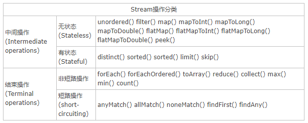
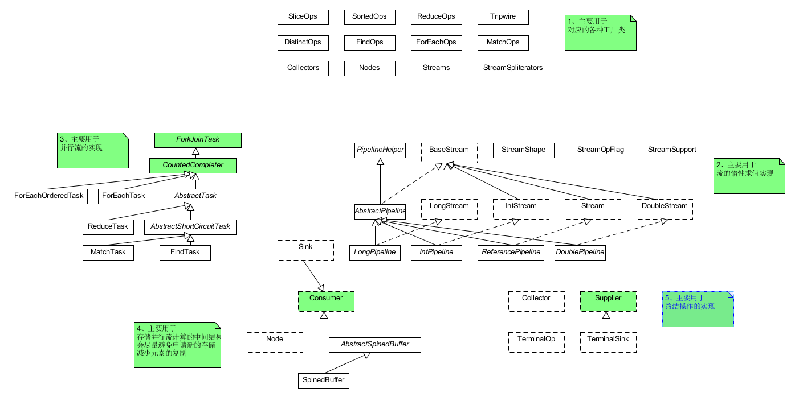
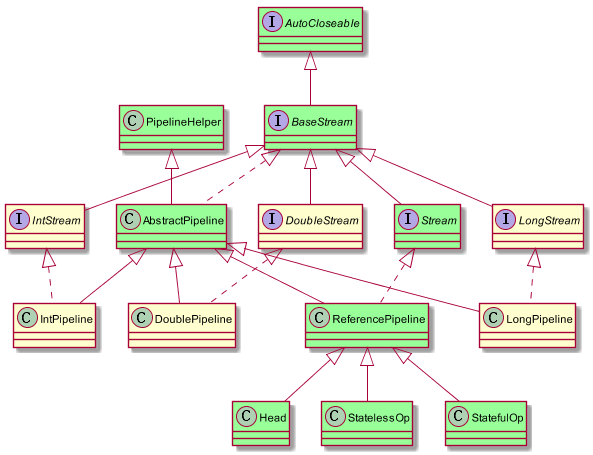
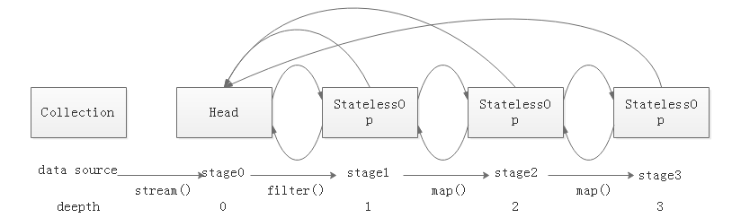
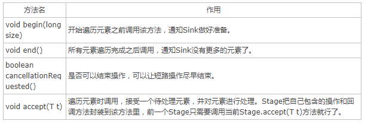
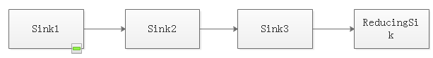
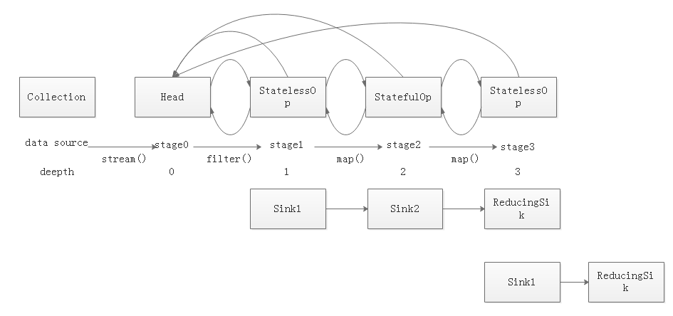
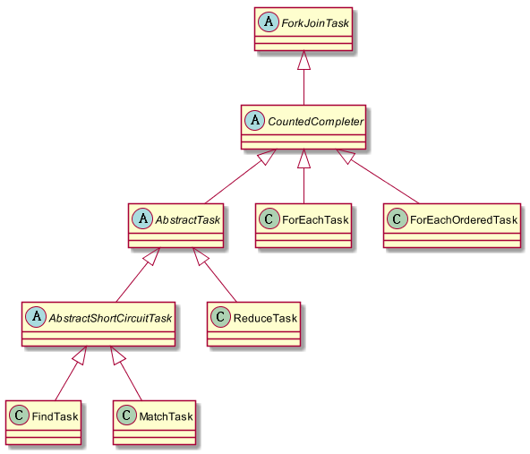
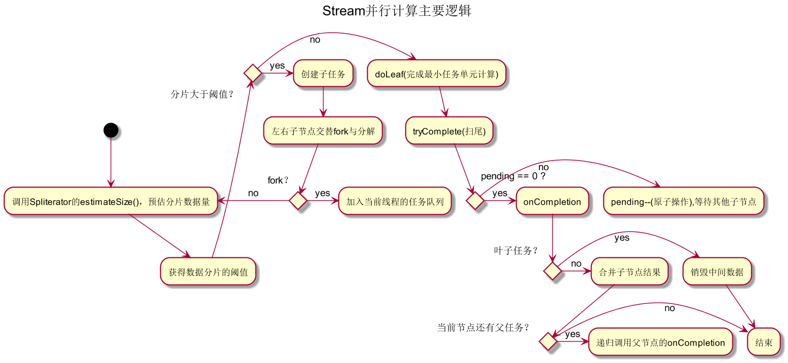

# Java8 Stream原理深度解析
> Author:Dorae  
> Date:2017年11月2日19:10:39
> 转载请注明出处

----

[上一篇文章](./Java8函数式编程详解/java8函数式编程详解.md)中简要介绍了Java8的函数式编程，而在Java8中另外一个比较大且非常重要的改动就是Stream。在这篇文章中，将会对流的实现原理进行深度，解析，具体关于如何使用，请参考《Java8函数式编程》。

## 常用的流操作

在深入原理之前，我们有必要知道关于Stream的一些基础知识，关于Stream的操作分类，如表1-1所示。

表1-1 Stream的常用操作分类([表格引自这里](http://www.cnblogs.com/CarpenterLee/p/6637118.html))

如表1-1中所示，**Stream中的操作可以分为两大类**：中间操作与结束操作，中间操作只是对操作进行了记录，只有结束操作才会触发实际的计算（即惰性求值），这也是Stream在迭代大集合时高效的原因之一。中间操作又可以分为无状态（Stateless）操作与有状态（Stateful）操作，前者是指元素的处理不受之前元素的影响；后者是指该操作只有拿到所有元素之后才能继续下去。结束操作又可以分为短路与非短路操作，这个应该很好理解，前者是指遇到某些符合条件的元素就可以得到最终结果；而后者是指必须处理所有元素才能得到最终结果。

## 原理探秘

在探究Stream的执行原理之前，我们先看如下两段代码（本文将以code_1为例进行说明）：

code_1

	public static void main(String[] args) {
		List<String> list = Lists.newArrayList(
				"bcd", "cde", "def", "abc");
		List<String> result = list.stream()
				//.parallel()
				.filter(e -> e.length() >= 3)
				.map(e -> e.charAt(0))
				//.peek(System.out :: println)
				//.sorted()
				//.peek(e -> System.out.println("++++" + e))
				.map(e -> String.valueOf(e))
				.collect(Collectors.toList());
		System.out.println("----------------------------");
		System.out.println(result);
	}

code_2

	public void targetMethod() {
		List<String> list = Lists.newArrayList(
				"bcd", "cde", "def", "abc");
		List<String> result = Lists.newArrayListWithCapacity(list.size());
		for (String str : list) {
			if (str.length() >= 3) {
				char e = str.charAt(0);
				String tempStr = String.valueOf(e);
				result.add(tempStr);
			}
		}
		System.out.println("----------------------------");
		System.out.println(result);
	}

很明显，在最终结果上而言，code_1与code_2是等价的。那么，Stream是怎么做的呢？显然不是每次操作都进行迭代，因为这对于执行时间与存储中间变量来说都将是噩梦。

### 要解决的问题

显然，如果code_2只对集合迭代了一次，也就是说相当高效。那么这么做有没有弊端？有！模板代码、中间变量、不利于并行都是其存在的问题。但是按着code_2的思路可以知道**有以下几个问题需要解决：**

+ 如何记录每次操作？
+ 操作如何叠加？
+ 叠加后的操作如何执行？
+ 最后的结果如何存储？

### 包结构分析

那么Stream是如何解决的呢？所谓源码之下，无所遁形。那么，首先来看一下Stream包的结构（如图1-1所示）。

图1-1 Stream包的结构示意图

其中各个部分的主要功能为：

1. 主要是各种操作的工厂类、数据的存储结构以及收集器的工厂类等；
2. 主要用于Stream的惰性求值实现；
3. Stream的并行计算框架；
4. 存储并行流的中间结果；
5. 终结操作的定义；

我们单独把第二部分拎出来用于**说明Stream的惰性求值实现**，如图1-2所示，Java8针对Int、long、double进行了优化，主要用于频繁的拆装箱。我们以引用类型进行介绍，在图中已经标为绿色。

+ BaseStream规定了流的基本接口，比如iterator、spliterator、isParallel等；
+ Stream中定义了map、filter、flatmap等用户关注的常用操作；
+ PipelineHelper主要用于Stream执行过程中相关结构的构建；
+ Head、StatelessOp、StatefulOp为ReferencePipeline中的内部类。

图1-2

### 操作如何记录

关于操作如何记录，在JDK源码注释中多次用（操作）stage来标识用户的每一次操作，而通常情况下Stream的操作又需要一个回调函数，所以一个完整的操作是由数据来源、操作、回调函数组成的三元组来表示。而在具体实现中，使用实例化的ReferencePipeline来表示，即图1-2中的Head、StatelessOp、StatefulOp的实例。

如code_3、code_4所示为调用stream.map()的关键的两个方法，在用户
调用一系列操作后会形成如图1-3所示的双链表结构。

图1-3

code_3(ReferencePipeline.map())

	@Override
    @SuppressWarnings("unchecked")
    public final <R> Stream<R> map(Function<? super P_OUT, ? extends R> mapper) {
        Objects.requireNonNull(mapper);
        return new StatelessOp<P_OUT, R>(this, StreamShape.REFERENCE,
                                     StreamOpFlag.NOT_SORTED | StreamOpFlag.NOT_DISTINCT) {
            @Override
            Sink<P_OUT> opWrapSink(int flags, Sink<R> sink) {
                return new Sink.ChainedReference<P_OUT, R>(sink) {
                    @Override
                    public void accept(P_OUT u) {
                        downstream.accept(mapper.apply(u));
                    }
                };
            }
        };
    }

code_4(AbstractPipeline.AbstractPipeline())

	AbstractPipeline(AbstractPipeline<?, E_IN, ?> previousStage, int opFlags) {
        if (previousStage.linkedOrConsumed)
            throw new IllegalStateException(MSG_STREAM_LINKED);
        previousStage.linkedOrConsumed = true;
        previousStage.nextStage = this;

        this.previousStage = previousStage;
        this.sourceOrOpFlags = opFlags & StreamOpFlag.OP_MASK;
        this.combinedFlags = StreamOpFlag.combineOpFlags(opFlags, previousStage.combinedFlags);
        this.sourceStage = previousStage.sourceStage;
        if (opIsStateful())
            sourceStage.sourceAnyStateful = true;
        this.depth = previousStage.depth + 1;
    }

### 如何叠加

在上一步已经在stage中记录了每一步操作，此时并没有执行。但是stage只是保存了当前的操作，并不能确定下一个stage需要何种操作，何种数据，其实JDK为此定义了Sink接口，其中只有begin()、end()、cancellationRequested()、accept()四个接口（如表1-2所示，[摘自这里](http://www.cnblogs.com/CarpenterLee/p/6637118.html)），其中中间操作的子类中包含一个指向下游sink的指针。

表1-2

现在转向code_3，可以看出，在satge链中，每一步都包含了opWrapSink()。当调用终结操作时，将会触发code_5从最后一个stage（终结操作产生的satge）开始，递归产生图1-4所示的结构。

code_5(AbstractPipeline.wrapSink())

	@Override
    @SuppressWarnings("unchecked")
    final <P_IN> Sink<P_IN> wrapSink(Sink<E_OUT> sink) {
        Objects.requireNonNull(sink);

        for ( @SuppressWarnings("rawtypes") AbstractPipeline p=AbstractPipeline.this; p.depth > 0; p=p.previousStage) {
            sink = p.opWrapSink(p.previousStage.combinedFlags, sink);
        }
        return (Sink<P_IN>) sink;
    }

图1-4

### 如何执行

所有的操作已经形成了图1-4的结构，接下来就会触发code_6，此时结果就会产生对应的结果啦！

code_6(AbstractPipelie.copyInto())

	@Override
    final <P_IN> void copyInto(Sink<P_IN> wrappedSink, Spliterator<P_IN> spliterator) {
        Objects.requireNonNull(wrappedSink);

        if (!StreamOpFlag.SHORT_CIRCUIT.isKnown(getStreamAndOpFlags())) {
            wrappedSink.begin(spliterator.getExactSizeIfKnown());
            spliterator.forEachRemaining(wrappedSink);
            wrappedSink.end();
        }
        else {
            copyIntoWithCancel(wrappedSink, spliterator);
        }
    }

## 并行原理

那么，Stream是如何并行执行的呢？其实产生stage链的过程和串行并没有区别，只是在最终执行时进行了相应的调整，我们将code_1改变为code_7

code_7

	public static void main(String[] args) {
		List<String> list = Lists.newArrayList(
				"bcd", "cde", "def", "abc");
		List<String> result = list.stream()
				.parallel()
				.filter(e -> e.length() >= 3)
				//.map(e -> e.charAt(0))
				//.peek(System.out :: println)
				.sorted()
				//.peek(e -> System.out.println("++++" + e))
				.map(e -> String.valueOf(e))
				.collect(Collectors.toList());
		System.out.println("----------------------------");
		System.out.println(result);
	}

那么最终产生的stage链与sink的结构如图1-5所示，因为此时stage链中有一个有状态操作（sorted()），也就是说在这里必须处理完所有元素才能进行下一步操作。那么此时无论是并行还是串行，此时都会产生两个sink链，也就是代表了两次迭代，才产生了最终结果。

图1-5

那么，究竟是如何并行的呢？其实当调用collect操作时会调用code_8，其中的evaluateParallel()如code_9所示。

code_8(AbstractPipeline.evaluate())

	final <R> R evaluate(TerminalOp<E_OUT, R> terminalOp) {
        assert getOutputShape() == terminalOp.inputShape();
        if (linkedOrConsumed)
            throw new IllegalStateException(MSG_STREAM_LINKED);
        linkedOrConsumed = true;

        return isParallel()
               ? terminalOp.evaluateParallel(this, sourceSpliterator(terminalOp.getOpFlags()))
               : terminalOp.evaluateSequential(this, sourceSpliterator(terminalOp.getOpFlags()));
    }

code_9(ReduceOp.evaluateParallel())

	@Override
        public <P_IN> R evaluateParallel(PipelineHelper<T> helper,
                                         Spliterator<P_IN> spliterator) {
            return new ReduceTask<>(this, helper, spliterator).invoke().get();
        }

其实Stream的并行处理是基于ForkJoin框架的，相关类与接口的结构如图1-6所示。其中AbstractShortCircuitTask用于处理短路操作，其他相关操作类似，会产生对应的Task。

图1-6

关于code_8中获取源Spliterator，如code_10所示，

code_10(AbstractPipeline.sourceSpliterator())

	@SuppressWarnings("unchecked")
    private Spliterator<?> sourceSpliterator(int terminalFlags) {
        Spliterator<?> spliterator = null;
        if (sourceStage.sourceSpliterator != null) {
            spliterator = sourceStage.sourceSpliterator;
            sourceStage.sourceSpliterator = null;
        }
        else if (sourceStage.sourceSupplier != null) {
            spliterator = (Spliterator<?>) sourceStage.sourceSupplier.get();
            sourceStage.sourceSupplier = null;
        }
        else {
            throw new IllegalStateException(MSG_CONSUMED);
        }

        if (isParallel() && sourceStage.sourceAnyStateful) {
            //如果是并行流并且有stage包含stateful操作
			//那么就会依次遍历stage，直到遇到stateful stage时
            int depth = 1;
            for (@SuppressWarnings("rawtypes") AbstractPipeline u = sourceStage, p = sourceStage.nextStage, e = this;
                 u != e;
                 u = p, p = p.nextStage) {

                int thisOpFlags = p.sourceOrOpFlags;
                if (p.opIsStateful()) {
                    depth = 0;

                    if (StreamOpFlag.SHORT_CIRCUIT.isKnown(thisOpFlags)) {
                        //如果有短路操作，则去除相应标记
                        thisOpFlags = thisOpFlags & ~StreamOpFlag.IS_SHORT_CIRCUIT;
                    }
					//尽量以惰性求值的方式进行操作
                    spliterator = p.opEvaluateParallelLazy(u, spliterator);

                    thisOpFlags = spliterator.hasCharacteristics(Spliterator.SIZED)
                            ? (thisOpFlags & ~StreamOpFlag.NOT_SIZED) | StreamOpFlag.IS_SIZED
                            : (thisOpFlags & ~StreamOpFlag.IS_SIZED) | StreamOpFlag.NOT_SIZED;
                }
                p.depth = depth++;
                p.combinedFlags = StreamOpFlag.combineOpFlags(thisOpFlags, u.combinedFlags);
            }
        }

        if (terminalFlags != 0)  {
            // Apply flags from the terminal operation to last pipeline stage
            combinedFlags = StreamOpFlag.combineOpFlags(terminalFlags, combinedFlags);
        }

        return spliterator;
    }

### 如何并行执行

关于各个task就行是如何并行执行，其实最终调用的是code_11所示，对应的流程如图1-7所示，其中交替fork子节点是为了缓和数据分片不均造成的性能退化。

code_11(AbstractTask.compute())

	@Override
    public void compute() {
        Spliterator<P_IN> rs = spliterator, ls; // right, left spliterators
        long sizeEstimate = rs.estimateSize();
        long sizeThreshold = getTargetSize(sizeEstimate);
        boolean forkRight = false;
        @SuppressWarnings("unchecked") K task = (K) this;
        while (sizeEstimate > sizeThreshold && (ls = rs.trySplit()) != null) {
            K leftChild, rightChild, taskToFork;
            task.leftChild  = leftChild = task.makeChild(ls);
            task.rightChild = rightChild = task.makeChild(rs);
            task.setPendingCount(1);
            if (forkRight) {
                forkRight = false;
                rs = ls;
                task = leftChild;
                taskToFork = rightChild;
            }
            else {
                forkRight = true;
                task = rightChild;
                taskToFork = leftChild;
            }
            taskToFork.fork();
            sizeEstimate = rs.estimateSize();
        }
        task.setLocalResult(task.doLeaf());
        task.tryComplete();
    }

图1-7

## 影响并行流的因素

数据大小；源数据结构（分割越容易越好），arraylist、数组比较好，hashSet、treeSet次之，linked最差；装箱；核的数量（可使用）；单元处理开销（越大越好）

## 建议：

终结操作以外的操作，尽量避免副作用，避免突变基于堆栈的引用，或者在执行过程中进行任何I/O；传递给流操作的数据源应该是互不干扰（避免修改数据源）。

## 小结

本文主要探究了Stream的实现原理，并没有涉及到具体的流操作的用法（读者可以参考《java8函数式编程》），并且给出了使用Stream的部分建议。

## 参考文章

[深入理解Java Stream流水线](http://www.cnblogs.com/CarpenterLee/p/6637118.html)  
[Java 8 Stream探秘](http://colobu.com/2014/11/18/Java-8-Stream/)  
[java.util.stream 库简介](https://www.ibm.com/developerworks/cn/java/j-java-streams-1-brian-goetz/index.html?ca=drs-)