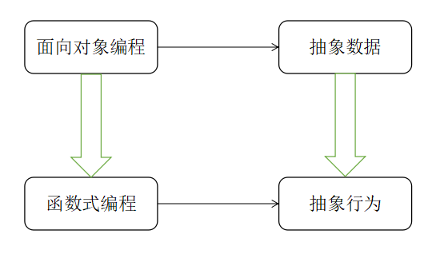
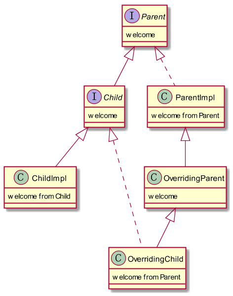
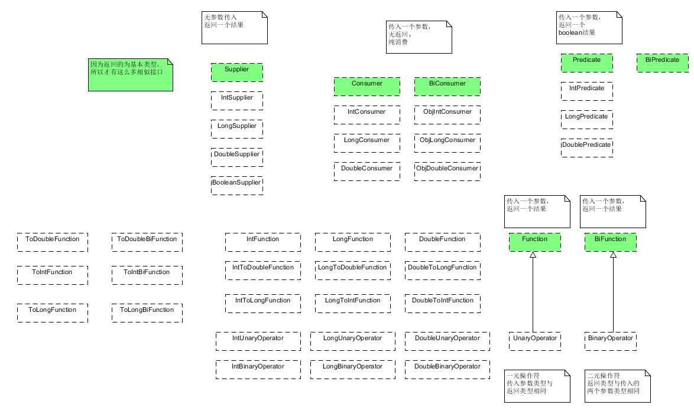

# Java8 函数式编程详解
> Author:Dorae  
> Date:2017年11月1日23:03:26  
> 转载请注明出处

----

说起Java8，可能很多人都已经知道其最大的改进，就是引入了Lambda表达式与Stream，毕竟Java9都已近发布了，Java8发布了也已经近三年。那么，今天我们就先来讲一下Java8引入的Lambda表达式，以及由此引入的函数式编程，以及函数式接口。

# 什么是函数式编程

函数式编程并不是Java新提出的概念，其与指令编程相比，强调函数的计算比指令的计算更重要；与过程化编程相比，其中函数的计算可以随时调用。

当然，大家应该都知道面向对象的特性（抽象、封装、继承、多态）。其实在Java8出现之前，我们关注的往往是某一类对象应该具有什么样的属性，当然这也是面向对象的核心--对数据进行抽象。但是java8出现以后，这一点开始出现变化，似乎在某种场景下，更加关注某一类共有的行为（这似乎与之前的接口有些类似），这也就是java8提出函数式编程的目的。如图1-1所示，展示了面向对象编程到面向行为编程的变化。

图1-1

# 为什么需要Lambda表达式

首先，不得不提增加Lambda的目的，其实就是为了支持函数式编程，而为了支持Lambda表达式，才有了函数式接口。另外，为了在面对大型数据集合时，为了能够更加高效的开发，编写的代码更加易于维护，更加容易运行在多核CPU上，java在语言层面增加了Lambda表达式。

# 第一个Lambda表达式

前边废话了这么多，其实Lambda就是Java新增的语法而已。当然，Lambda（我们认为这里包含了方法引用）确实能够给我们的开发带来许多便利。  
首先，在java8之前，如果需要建立一个线程，很大可能会写出下面的代码：

	new Thread(new Runnable()) {
		@Override
		public void run() {
			System.out.println("Hello World!");
		}
	}).start();

但是Java8引入Lambda之后，也许这样写会更好：

	new Thread(
		() -> System.out.println("Hello world!");
	);

很明显，Lambda可以帮助我们减少模板代码的书写，同时减少了要维护的匿名内部类，当然，其作用绝不仅仅这么一点（关于Lambda的具体使用，读者可以参考java8函数式编程这本书，作者解析的很详细）。接下来我们先来看一下java8关于接口的的变动。

# Java8中接口的变化

其实Java9中关于接口，又有了进一步的变动，这里我们暂且局限于Java8。在Java8中，接口可以包含静态方法，另外还增加了一个用于修饰方法的关键字--default，称之为默认方法（带有方法体）。

+ 静态方法

其实Java8中增加静态方法，目的完全出于编写类库，对某些行为进行抽象（还记得我们之前用类去做吗？）。但是有一点不同的是：类中的静态方法可以继承，并且可以从实例获得引用（并不建议这么做）；但是接口中的静态方法不能被继承。

+ 默认方法

其实，引入默认方法，是不得已而为之，因为Java8引入了函数式接口，许多像Collection这样的基础接口中增加了方法，如果还是一个传统的抽象方法的话，那么可能很多第三方类库就会变得完全无法使用。为了实现二进制的向后兼容性，引入了带有方法体、被default修饰的方法--默认方法。其主要思想就是如果子类中没有实现，那么采用父类提供的默认实现。其具体的继承规则如图1-2所示。

图1-2

其中Parent接口中定义了默认方法welcome；  
Child接口对默认方法进行了覆盖；  
ParentImpl继承了Parent接口的方法；  
ChildImpl继承了Child的方法；  
OverridingParent覆盖了父类的welcome；
OverridingChild最终的welcome来自于OverridingParent。

关于继承规则，可以简短描述为：**类胜于接口；子类胜于父类；如果前两者都不适用，那么子类要么实现该方法，要么将该方法声明为抽象方法。**

# 函数式接口

关于接口的变动，Java8中新定义了一种接口类型，函数式接口，与其他接口的区别就是：
+ 函数式接口中只能有一个抽象方法（我们在这里不包括与Object的方法重名的方法）；
+ 可以有从Object继承过来的抽象方法，因为所有类的最终父类都是Object；
+ 接口中唯一抽象方法的命名并不重要，因为函数式接口就是对某一行为进行抽象，主要目的就是支持Lambda表达式。

Java8之前已经存在的函数式接口有：
 
java.lang.Runnable  
java.util.concurrent.Callable  
java.security.PrivilegedAction  
java.util.Comparator  
java.io.FileFilter  
java.nio.file.PathMatcher  
java.lang.reflect.InvocationHandler  
java.beans.PropertyChangeListener  
java.awt.event.ActionListener  
javax.swing.event.ChangeListener

另外，Java8还提供了@FunctionalInterface注解来帮助我们标识函数式接口。另外需要注意的是函数式接口的目的是对某一个行为进行封装，某些接口可能只是巧合符合函数式接口的定义。

如图1-3所示，为java8的Function包的结构（即新引入的函数式接口），图中绿色表示主要引入的新接口，其他接口基本上都是为了支持基本类型而添加的接口，方法的具体作用图中有具体说明。

图1-3

# 自定义函数式接口支持Lambda表达式

看下如下代码，最终输出应该是两行"Hello World！"，是不是很神奇？

	public class Main {
		public static void main(String[] args) {
			Action action = System.out :: println;
			action.execute("Hello World!");
			test(System.out :: println, "Hello World!");
		}
	
		static void test(Action action, String str) {
			action.execute(str);
		}
	}
	@FunctionalInterface
	interface Action<T> {
		public void execute(T t);
	}

# 小结

本文对Lambda以及函数式接口进行了简要介绍，目的是激发大家使用Lambda的兴趣，步入函数式编程的大门。